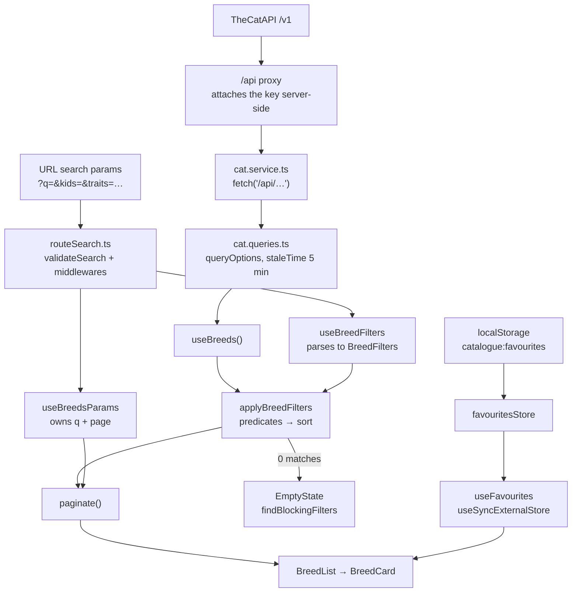

# Architecture

React 19 + TypeScript on Vite, with TanStack Router for navigation and TanStack Query for
server state. There is no Redux, no context provider of our own, and no global store beyond
one small external store for favourites — everything else is either URL state or query cache.

## The one fact that explains the rest

**TheCatAPI returns every breed in a single `/breeds` response, and the app never asks it to
filter.** Search, the filter sidebar, sorting, pagination, similar breeds and the empty-state
explanations all run client-side over that one array.

That is why:

- Filtering can be **instant** — no request per keystroke, so the 250 ms debounce on the search
  box exists only to keep the URL from thrashing, not to spare the network.
- The empty state can be **specific**. `findBlockingFilters` re-runs the whole filter pipeline
  once per active filter to work out which one is to blame. That is only affordable because it
  is array work over ~70 objects, not a round trip.
- Counts are **exact and immediate** — "14 of 67" needs no separate count endpoint.
- The e2e suite can mock one endpoint and pin every number in every assertion.

If breed data ever outgrows a single response, this is the assumption that breaks first.

## Layers

```
main.tsx                 QueryClient + RouterProvider, queryClient passed as router context
  └─ router.tsx          Route tree, loaders, search-param validation
       └─ App.tsx        Header + <Outlet />
            └─ pages/    BreedsPage, BreedPage, FavouritesPage, ErrorPage
                 └─ components/  breed/ (domain) and common/ (generic)

hooks/        Thin wrappers: useQuery bindings, URL readers/writers, favourites
services/     cat/ (fetch + queryOptions + models), favourites store, localStorage helpers
utils/        Pure functions: filtering, pagination maths, similar breeds, thumbnail slots
```

The dependency direction is one-way: `utils/` imports only models, `services/` never imports
components, and components never call `fetch`.

## Data flow



Two independent sources of truth meet in the components: **the URL** decides what you are
looking at, **the query cache** holds what was fetched. Favourites are a third, deliberately
separate, store — see below.

## Routing

`router.tsx` builds four routes under a root that owns the header, the error boundary and the
search-param schema.

| Route | Component | Loader prefetches |
|---|---|---|
| `/` | — (redirects to `/breeds`) | — |
| `/breeds` | `BreedsPage` | `breedsQuery()` |
| `/breeds/$breedId` | `BreedPage` | `breedQuery(id)` + `breedImagesQuery(id)` |
| `/favourites` | `FavouritesPage` | `breedsQuery()` |

Three details worth knowing:

- **Loaders call `prefetchQuery`, not `ensureQueryData`, and nothing awaits them.** Navigation is
  never blocked on the network; the page mounts immediately and its `useQuery` renders the
  loading state. The loader just gets the request started earlier than the component could.
- **`defaultPreload: 'intent'`** starts that prefetch on hover/focus, so a click usually lands on
  warm cache.
- **The search schema lives on the root route**, so every route shares one `AppSearch` shape.
  That is what lets a filtered link survive a trip to a detail page and back.

## The API proxy

`cat.service.ts` never talks to TheCatAPI. `API_BASE_URL` is the literal string `/api`, and no
request carries a key — the client calls its own origin and something server-side forwards it.

That is not a style choice. Vite inlines every `import.meta.env.VITE_*` reference into the
bundle at build time, so a key read from client code is a key published to every visitor. The
only way to keep it secret is for client code never to see it. Nothing under `src/` reads an
environment variable at all.

The forwarding half exists twice, once per environment, and neither implementation ever runs
where the other does:

| Environment | Serves `/api/*` | Reads the key from |
|---|---|---|
| `npm run dev` | `server.proxy` in `vite.config.ts` | `.env`, via `loadEnv(mode, cwd, '')` |
| Vercel | `api/proxy.js`, routed by `vercel.json` | `process.env.CAT_API_KEY` |
| `npm run preview` | nothing — `/api` 404s | — |
| `npm run test:e2e` | Playwright route mocks | — |

`loadEnv`'s third argument is an empty string, which drops Vite's default `VITE_` prefix filter.
That is the only reason a variable named `CAT_API_KEY` is visible to the config at all — and
because the config runs in Node rather than the browser, reading it there leaks nothing.

Two consequences worth remembering:

- **They must be kept in step by hand.** Change how one rewrites a path and the other needs the
  same change; nothing catches the drift.
- **`preview` is not a smoke test.** It serves the built assets with no proxy, so the app renders
  its error state. `vercel dev` runs the build *and* the function.

## Server state

`cat.service.ts` holds three plain `fetch` functions that throw on a non-OK response.
`cat.queries.ts` wraps each in `queryOptions` with a shared 5-minute `staleTime` — breed data is
reference data, and refetching it on every focus would be noise. Hooks (`useBreeds`, `useBreed`,
`useBreedImages`) are one-liners over those options, so the query key and stale time cannot
drift between a loader and a component.

Errors surface as the query's `isError`; React Query retries three times with backoff before
that, which is why the two error-path e2e tests carry a longer timeout.

## URL as state

`routeSearch.ts` defines `AppSearch` (seven params), their defaults, and `validateSearch`, which
**normalises rather than rejects**: an out-of-range `kids`, an unknown trait, a malformed
`grooming` list or a bogus `sort` all fall back to the default. A hand-edited URL degrades to
"no filter" instead of an error page.

Two middlewares finish the job:

- `stripSearchParams(DEFAULT_SEARCH)` keeps defaults out of the address bar, so a clean URL
  genuinely means no filters.
- `retainSearchParams(SEARCH_KEYS)` carries the params across navigations, which is why
  "Back to results" returns to the same filtered page.

Reading and writing is split across two hooks by ownership: `useBreedsParams` owns `q` and
`page`, `useBreedFilters` owns the filter set. Both write with `replace: true` so filtering does
not fill the back button with intermediate states, and both reset `page` to 1 on any change so a
narrowed result set never lands on an empty page.

## Favourites

Favourites are the one piece of state that is neither in the URL nor from the server — they
belong to the browser, so putting them in a shareable link would be wrong.

`favourites.store.ts` is a hand-rolled external store: a module-level array, a `Set` of
listeners, and `subscribe`/`getSnapshot` consumed by `useSyncExternalStore` in `useFavourites`.
It also listens for the `storage` event, so saving a breed in one tab updates every other tab.
`storage.ts` wraps `localStorage` with try/catch on both read and write — private-mode and
quota failures degrade to "no favourites" rather than crashing the app.

## Rendering conventions

Components split into `breed/` (knows about the `Breed` model) and `common/` (generic, reusable).
The common layer wraps native elements — `Button`, `Input`, `Select`, `Typography` — so that
styling and behaviour have one home each. See [components.md](./components.md) for props and
[conventions.md](./conventions.md) for the rules those wrappers exist to enforce.
